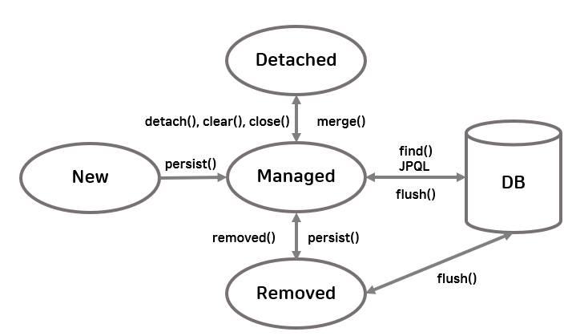
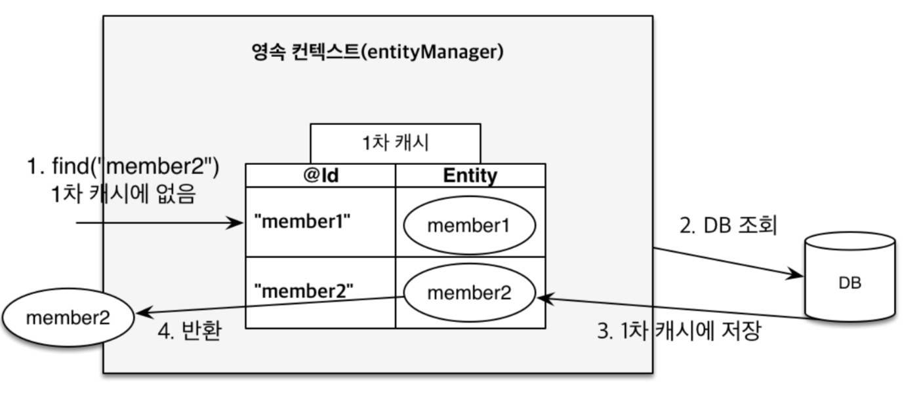
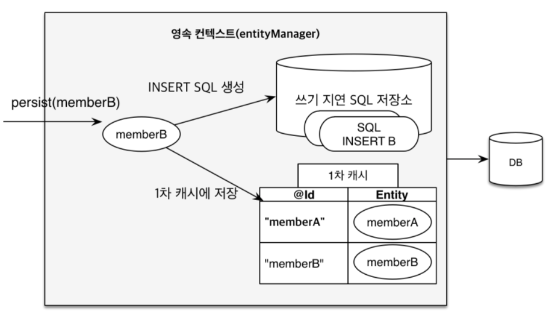
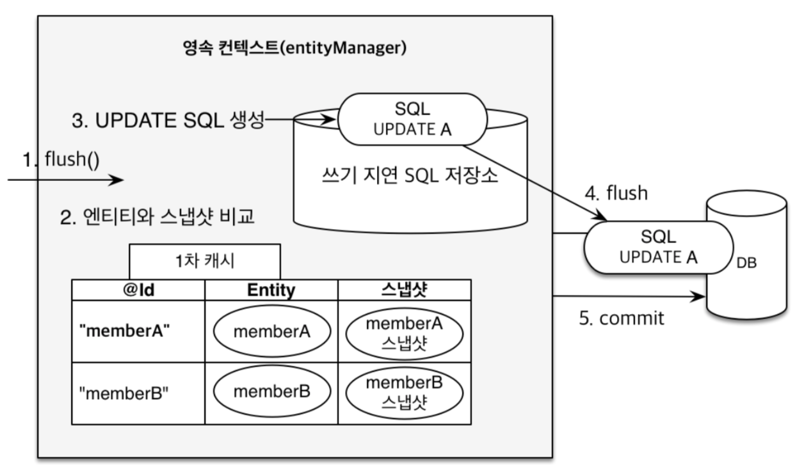

## JPA
### JPA 란
Hibernate ORM 프레임워크를 기반으로 만든 Java ORM 기술 표준으로 Java ORM 기술에 대한 API 표준 명세이다.
쉽게 말해서 API 모음, 명세일뿐이다.

따라서 JPA 를 사용하려면 JPA 를 구현한 ORM 프레임워크를 선택해야 한다.
JPA 를 구현한 ORM 프레임워크로는 Hibernate, EclipseLink, DataNucleus 가 있으며
이 중 하이버네이트를 가장 많이 사용한다. 또한 JPA 가 생기기 전부터 있던 프레임워크다보니
JPA 이전 기술도 포함하고 있다.

```java
public class JpaMain {

    public static void main(String[] args) {
        // 엔티티 매니저 팩토리 생성
        EntityManagerFactory emf = Persistence.createEntityManagerFactory("jpa");
        // 엔티티 매니저 생성
        EntityManager em = emf.createEntityManager();
        // 트랜잭션 획득
        EntityTransaction et = em.getTransaction();
        
        try {
            et.begin(); // 트랜잭션 시작
            logic(em); // 비즈니스 로직 실행
            et.commit(); // 트랜잭션 커밋
        } catch (Exception e) {
            tx.rollback(); // 트랜잭션 롤백
        } finally {
            em.close(); // 엔티티 매니저 종료
        }
        emf.close(); // 엔티티 매니저 팩토리 종료
    }
    
    private void logic(Entitymanager em) {}
}
```

### Spring Data JPA
스프링 프레임워크에서 JPA 를 편리하게 사용할 수 있도록 지원하는 프로젝트이다.

스프링 데이터 프로젝트의 하위 프로젝트이며 스프링 데이터 프로젝트는
JPA, 몽고 DB, REDIS, HADOOP 과 같은 다양한 데이터 저장소에 대한
접근을 추상화하여 개발자 편의를 제공하고 지루하게 반복되는 데이터 접근 코드를 줄여준다.

### Persistence Context
영속성 컨텍스트는 **'엔티티를 영구 저장하는 환경'** 정도로 해석할 수 있다.

엔티티 매니저로 엔티티를 저장하거나 조회하면 엔티티 매니저는 영속성 컨텍스트에 엔티티를 보관하고 관리한다.
```jpaql
em.persist(member);
```
#### 엔티티의 생명주기
1. 비영속(new/transient) - 영속성 컨텍스트와 전혀 관련이 없는 상태
2. 영속(managed) - 영속성 컨텍스트에 저장된 상태
3. 준영속(detached) - 영속성 컨텍스트에 저장되었다가 분리된 상태
4. 삭제(removed) - 삭제된 상태



#### 영속성 컨텍스트의 특징
* 영속성 컨텍스트는 식별자 값(@Id 로 테이블의 기본 키와 매핑한 값)이 반드시 있어야 한다.
* 영속성 컨텍스트는 트랜잭션을 커밋하는 순간 영속성 컨텍스트에 새로 저장된 엔티티를 데이터베이스에 반영하는데 이것을 flush 라 한다.
* 영속성 컨텍스트의 장점
  * 1차 캐시
  * 동일성 보장
  * 트랜잭션을 지원하는 쓰기 지연
  * 변경 감지
  * 지연 로딩

1. 1차 캐시
   * 영속 상태의 엔티티 저장소
   * 1차 캐시의 키는 식별자 값
   * find 메서드 사용 시 1차 캐시에서 먼저 찾고 없는 경우 데이터베이스에서 찾는다.

2. 트랜잭션을 지원하는 쓰기 지연
   * 엔티티 매니저는 트랜잭션을 커밋하기 직전까지 데이터베이스에 엔티티를 저장하지 않고 내부 쿼리 저장소에 쿼리를 차곡차곡 모아둔다.
   * 트랜잭션을 커밋할 때 모아둔 쿼리를 데이터베이스에 보내는데 이것을 트랜잭션을 지원하는 쓰기 지연(transactional write-behind)이라고 한다.

3. 변경 감지
   * JPA 는 영속성 컨텍스트에 보관할 때 최초 상태를 보관해서 저장해두는데 이것을 스냅샷이라 한다.
   * 플러시 시점에 스냅샷과 엔티티를 비교해서 변경된 엔티티를 찾는다.
   * 변경된 엔티티가 있으면 수정 쿼리를 쓰기 지연 SQL 저장소에 보낸다.

### QueryDSL
JPQL 을 편하게 작성하도록 도와주는 빌더 클래스 모음으로 비표준 오픈소스 프레임워크이다.

**사용 이유**
* 가독성
* 컴파일 시점에 오류 확인 가능
* 벌크 연산
* 동적 쿼리 작성

**단점**
* QClass 에 종속되고 관리가 필요
* 러닝 커브가 높은 편
* 버전 별 설정이 중구난방인 편

### nativeSQL
**사용 이유**
* 특정 데이터베이스만 지원하는 SQL 힌트
* 벌크 연산

> nativeSQL 벌크 연산 시 주의점
> 
> 데이터 변경 쿼리 (update, delete 등) 사용 시 @Modifying 어노테이션을 같이 작성해야 한다. 안할 경우 에러가 발생한다.
> 
> 이때 @Modifying 어노테이션은 JPA Entity Life Cycle 을 무시하기 때문에 영속성 컨텍스트 관리에 주의가 필요하다.
> 
> 단건 연산의 경우 JPA 의 변경 감지 기능을 많이 사용하고 delete 벌크 연산일 경우 JPA 에서 지원하는 deleteAllInBatch 을 사용한다.

**단점**
* 특정 데이터베이스에 종속적이어서 변경이 있을 경우 많은 비용이 들 수 있다.